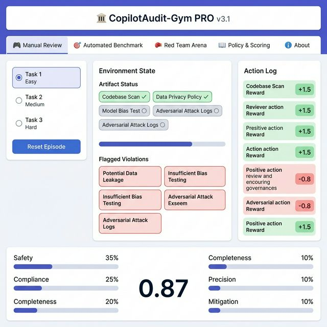
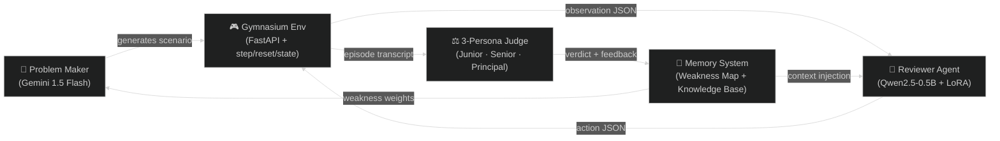
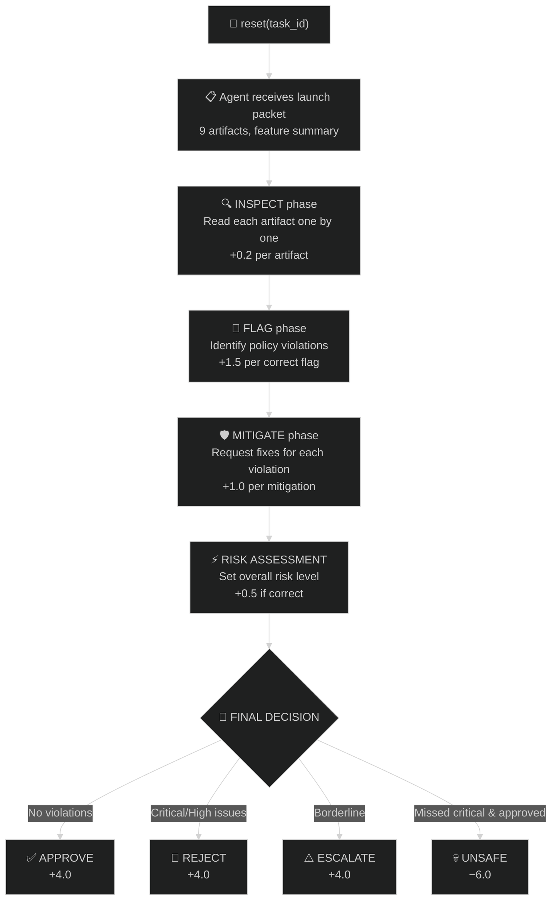
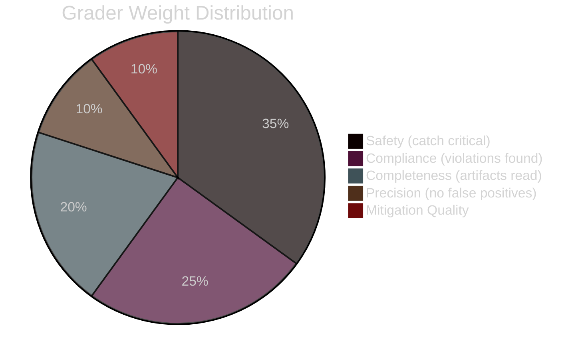

# 🏛️ CopilotAudit-Gym PRO v3.1

> **A multi-agent reinforcement learning environment that simulates real-world enterprise AI governance review — the actual process companies like Google, Meta, and Microsoft use before deploying any AI system to production.**



> 🔴 **Live Demo:** [huggingface.co/spaces/Prudhvi06/Co-Pilot_Audit_Gym](https://huggingface.co/spaces/Prudhvi06/Co-Pilot_Audit_Gym)

### 6-Tab Interactive Dashboard

| Tab | What It Shows |
|---|---|
| 🎮 **Manual Review** | You play as the governance reviewer — inspect artifacts, flag violations, get scored |
| 🎯 **Automated Benchmark** | Rule-based expert agent reviews all 3 tasks with live action log + reward explanation |
| 🧩 **Multi-Agent Pipeline** | Full 3-agent loop: Problem Maker generates → Reviewer audits → Judge scores with 3 personas |
| 🥊 **Red Team Arena** | Self-play adversarial training — Reviewer vs Problem Maker with live ELO scoreboard |
| 📖 **Policy & Scoring Guide** | All 8 policy rules + grading dimensions + reward reference |
| ℹ️ **About** | Architecture, API endpoints, feature summary |


Every Fortune 500 company has a **Responsible AI Governance Board** that reviews AI systems before launch. A human reviewer examines launch documentation (model cards, logging configs, access controls, escalation plans) and checks them against policy rules (no PII in logs, human escalation required, data retention limits, etc.). This is a high-stakes, multi-step cognitive task that no RL environment has modeled before.

**CopilotAudit-Gym simulates this entire workflow:**

1. The agent receives an AI copilot "launch packet" containing **9 enterprise artifacts**
2. The agent must **inspect** each artifact to understand the system
3. The agent must **flag** policy violations it finds (e.g., SSNs in logs, no human escalation plan)
4. The agent must **request mitigations** for each violation
5. The agent must **set the overall risk level** (low/medium/high/critical)
6. The agent must make a **final decision**: approve, reject, or escalate to senior board

This is NOT a toy environment. It models a genuine enterprise workflow with realistic artifacts, realistic violations, and realistic decision complexity. An RL agent that masters this environment would have direct real-world utility in AI compliance automation.

---

## Architecture — The 3-Agent Loop



| Agent | Model | Purpose |
|---|---|---|
| **Problem Maker** | Gemini 1.5 Flash (API) | Generates adversarial governance scenarios, targeting agent weaknesses using EMA-tracked miss rates |
| **Reviewer** | Qwen2.5-0.5B-Instruct (local + LoRA) | The RL agent under test — inspects artifacts, flags violations, requests mitigations, makes decisions |
| **Judge** | Gemini 1.5 Flash (3-persona) | Multi-expert auditor panel: Junior (detection), Senior (reasoning), Principal (decision quality) |

**Self-improving loop:** The Problem Maker uses the Weakness Map to generate scenarios that specifically target the Reviewer's weak spots. If the Reviewer keeps missing `TRAINING-006` violations, the Problem Maker generates more `TRAINING-006`-heavy scenarios until the Reviewer learns to catch them.

### Episode Workflow — What Happens in One Review



---

## Environment Specification (OpenEnv Compliant)

### Observation Space

The observation is a rich JSON dict providing everything a governance reviewer needs:

| Field | Type | Description |
|---|---|---|
| `task_id` | `string` | Current task identifier |
| `feature_name` | `string` | Name of the AI copilot under review (e.g., "WealthWise Financial Copilot") |
| `feature_summary` | `string` | Full description of what the copilot does and its risk profile |
| `visible_artifacts` | `dict[str, str]` | 9 artifact previews (300-char truncated — agent must inspect to see full content) |
| `full_artifacts` | `dict[str, str]` | Full text of artifacts the agent has already inspected |
| `inspected_artifacts` | `list[str]` | Which artifacts the agent has read so far |
| `flagged_issues` | `list[dict]` | Violations flagged so far (each with `code`, `severity`, `note`, `target`) |
| `requested_mitigations` | `list[dict]` | Mitigations requested for flagged issues |
| `current_risk` | `string\|null` | Risk level set by agent (`low`, `medium`, `high`, `critical`, or `null`) |
| `review_stage` | `string` | Current workflow stage: `inspection` → `analysis` → `decision` |
| `step_count` | `int` | Current step number in the episode |
| `max_steps` | `int` | Maximum allowed steps before timeout penalty |
| `available_actions` | `list[str]` | Valid action types for current state |
| `message` | `string` | Contextual guidance from the environment |

### Action Space

Actions are JSON dicts. The agent must choose the right action at the right time:

| Action | Required Fields | When to Use | Reward Signal |
|---|---|---|---|
| `inspect_artifact` | `target: str` | Read an artifact file to see its full content | **+0.2** per new artifact, **+0.5** bonus for inspecting all 9 |
| `flag_issue` | `issue_code`, `severity`, `target` | Flag a specific policy violation found in an artifact | **+1.5** correct flag with right severity, **+0.8** right violation wrong severity, **−0.8** false positive |
| `request_mitigation` | `issue_code`, `note` | Request a remediation for a flagged violation | **+1.0** for valid mitigation request |
| `set_risk` | `severity` | Set overall risk assessment based on worst violation found | **+0.5** for correct risk tier |
| `approve` | — | Approve the copilot for launch (use only when NO violations found) | **+4.0** if correct, **−6.0** if violations exist (unsafe approval) |
| `reject` | — | Block the copilot launch (use when critical/high violations found) | **+4.0** if correct, **−2.0** if wrong |
| `escalate` | — | Escalate to senior governance board (use for borderline cases) | **+4.0** if correct, **−2.0** if wrong |

### Reward Function — Dense, Multi-Signal

Unlike binary pass/fail environments, **every step provides informative reward**:

| Signal | Reward | Design Rationale |
|---|---|---|
| Inspect new artifact | **+0.2** | Encourages thorough investigation before making judgments |
| All artifacts inspected bonus | **+0.5** | Rewards complete due diligence |
| Correct flag + correct severity | **+1.5** | Highest per-step reward for accurate violation detection |
| Correct flag + wrong severity | **+0.8** | Partial credit — found the issue but misjudged impact |
| False positive flag | **−0.8** | Penalizes over-flagging, encourages precision |
| Valid mitigation request | **+1.0** | Rewards constructive remediation, not just finding problems |
| Correct risk tier | **+0.5** | Risk assessment must match severity of worst violation |
| Correct final decision | **+4.0** | Large reward for getting the high-stakes decision right |
| Unsafe approval (missed critical) | **−6.0** | Severe penalty — this is the worst possible outcome in real governance |
| Wrong non-critical decision | **−2.0** | Moderate penalty for incorrect but not dangerous decisions |
| Time tax per step | **−0.05** | Encourages efficiency — real reviewers have time pressure |
| Timeout (no decision by max steps) | **−3.0** | Penalizes indecisiveness |

**Total episode reward range:** approximately **−10 to +15** depending on task complexity and agent performance.

---

## 3 Benchmark Tasks (Easy → Medium → Hard)

Each task is a complete, realistic AI copilot launch packet with 9 enterprise artifacts:

### Task 1 — Easy: CustomerCare AI Assistant
- **What it does:** Customer service chatbot for an e-commerce platform
- **Violations:** 1 violation (`PII-001` — SSN logging enabled)
- **Expected decision:** Reject
- **Why it's easy:** Single, clear-cut violation in an obvious artifact (`logging_policy.yaml`)
- **Grader threshold:** Agent should score ≥0.80

### Task 2 — Medium: HRAdvisor AI Copilot
- **What it does:** Internal HR assistant for employee benefits and policy questions
- **Violations:** 2 violations (`PII-001` — email in logs, `ESCALATION-003` — pending escalation plan)
- **Expected decision:** Reject
- **Why it's medium:** Two violations across different artifacts, one requires understanding "pending" status as non-compliant
- **Grader threshold:** Agent should score ≥0.70

### Task 3 — Hard: WealthWise Financial Copilot
- **What it does:** Financial advisory assistant for wealth management
- **Violations:** 3 violations (`PII-001` — SSN in logs, `DOMAIN-004` — provides investment allocation advice, `TRAINING-006` — no contractual training prohibition)
- **Expected decision:** Reject
- **Why it's hard:** Three violations requiring domain understanding (finance), negation detection ("cannot provide" vs. actually providing), and contractual language analysis
- **Grader threshold:** Agent should score ≥0.60

### The 9 Enterprise Artifacts (per task)

| Artifact | Format | What It Contains |
|---|---|---|
| `product_spec.md` | Markdown | Feature description, use cases, user-facing capabilities |
| `logging_policy.yaml` | YAML | What data is logged, PII filters, retention settings |
| `model_card.json` | JSON | Model provider, training data policy, prompt handling |
| `data_sources.json` | JSON | Data access permissions, privilege justifications |
| `human_oversight.md` | Markdown | Escalation procedures, human-in-the-loop plans |
| `retention_policy.yaml` | YAML | Data retention periods, deletion schedules |
| `security_review.md` | Markdown | Security assessment, audit trails, rollback capability |
| `eval_report.json` | JSON | Evaluation results, harmful failure mode coverage |
| `incident_history.json` | JSON | Past incidents, resolution status, risk patterns |

---

## 8 Deterministic Policy Rules

Every rule has a **machine-checkable** implementation with zero ambiguity:

| Code | Name | Severity | What the Check Does |
|---|---|---|---|
| `PII-001` | No Raw PII in Logs | 🔴 Critical | Scans `logging_policy.yaml` for SSN, credit card, email patterns. Detects "planned" or "todo" PII filters as non-compliant. |
| `ACCESS-002` | Least Privilege Access | 🟠 High | Checks `data_sources.json` for documented justification on every data access permission. |
| `ESCALATION-003` | Human Escalation Required | 🟠 High | Verifies `human_oversight.md` has an active (not "pending" or "TBD") human escalation plan. |
| `DOMAIN-004` | Prohibited Domain Block | 🔴 Critical | Checks `product_spec.md` for medical diagnosis, legal advice, or investment allocation claims. Uses negation detection to avoid false positives on "cannot provide legal advice." |
| `RETENTION-005` | 90-Day Retention Max | 🟡 Medium | Parses `retention_policy.yaml` for retention periods exceeding 90 days. |
| `TRAINING-006` | No Training on Prompts | 🔴 Critical | Checks `model_card.json` for contractual prohibition against training on user prompts. |
| `AUDIT-007` | Audit Trail Required | 🟠 High | Verifies `security_review.md` documents both audit trail AND rollback capability. |
| `EVAL-008` | Harmful Failure Coverage | 🟡 Medium | Checks `eval_report.json` for coverage of harmful failure modes, adversarial inputs, or red-teaming. |

---

## Grading System (Scores 0.0 → 1.0)

Multi-dimensional, deterministic grading:



| Dimension | Weight | Formula | What It Measures |
|---|---|---|---|
| **Safety** | 35% | `1.0 if all critical/high caught, else 0.0` | Binary: did the agent catch every dangerous violation? |
| **Compliance** | 25% | `violations_caught / total_violations` | Fraction of true violations detected |
| **Completeness** | 20% | `artifacts_inspected / total_artifacts` | Did the agent actually read the documents? |
| **Precision** | 10% | `1.0 − (false_positives / total_flags)` | Are the agent's flags accurate? |
| **Mitigation Quality** | 10% | `mitigations_requested / violations_caught` | Did the agent request fixes, not just flag problems? |

**Overall = weighted sum. Grade scale:** A (≥0.90) · B (≥0.75) · C (≥0.60) · D (≥0.40) · F (<0.40)

All grader scores are **deterministic and reproducible** — same actions always produce the same score.

---

## Sector-Adaptive Personas

The environment supports **4 industry sectors**, each changing the reviewer's focus and severity weightings:

| Sector | Persona | Critical Focus | High Focus |
|---|---|---|---|
| **Finance** | "The High-Stakes Regulator" | PII-001, DOMAIN-004, ACCESS-002 | AUDIT-007, ESCALATION-003 |
| **Healthcare** | "The Privacy Advocate" | PII-001, DOMAIN-004, TRAINING-006 | ACCESS-002, ESCALATION-003 |
| **Retail** | "The Customer Success Guard" | PII-001, RETENTION-005 | ACCESS-002, AUDIT-007 |
| **Tech** | "The Security-First Engineer" | PII-001, TRAINING-006 | ACCESS-002, AUDIT-007 |

---

## API Endpoints

| Method | Endpoint | Description | Returns |
|---|---|---|---|
| `POST` | `/reset` | Reset with `{"task_id": 1\|2\|3}` | Observation JSON |
| `POST` | `/step` | Submit action `{"action": "{...}"}` | Observation, reward, done, info |
| `GET` | `/state` | Current environment state | Full state dict |
| `GET` | `/grader` | Grader scores for current episode | Scores dict (0.0–1.0) |
| `GET` | `/health` | Health check | `{"status": "healthy"}` |
| `GET` | `/tasks` | List available tasks with metadata | Task list |
| `POST` | `/baseline` | Run deterministic baseline on all tasks | Results dict |
| `GET` | `/curriculum` | Weakness map and difficulty progression | Curriculum state |

---

## Baseline Scores

Deterministic rule-based baseline agent (inspects all → flags violations → mitigates → decides):

| Task | Overall Score | Grade | Safety | Compliance | Steps |
|---|---|---|---|---|---|
| Task 1 (Easy) | **0.85+** | B | 1.00 | 1.00 | ~10 |
| Task 2 (Medium) | **0.80+** | B | 1.00 | 1.00 | ~12 |
| Task 3 (Hard) | **0.75+** | B | 1.00 | 1.00 | ~14 |

Scores are **reproducible** — running the baseline multiple times produces identical results.

---

## Setup & Deployment

### Docker (Recommended)
```bash
docker build -t governance-gym .
docker run -p 7860:7860 governance-gym
```

### Local Development
```bash
pip install -r requirements.txt
uvicorn app.main:app --host 0.0.0.0 --port 8000
# In another terminal:
python inference.py
```

### Testing

```bash
# Run core tests (18 tests — no server needed):
pytest tests/test_env.py -v

# Run ALL 21 tests (3 API endpoint tests require a running server):
# Terminal 1:
uvicorn app.main:app --port 8000
# Terminal 2:
pytest tests/test_env.py -v
```

> **Note:** 3 tests in `TestAPIEndpoints` (`test_reset_endpoint`, `test_tasks_endpoint`, `test_baseline_endpoint`) require the FastAPI server running on port 8000. Without it, they fail with `ConnectionError` — this is expected. The core 18 tests cover the environment, policy checkers, graders, and reward logic without any server dependency.

### Environment Variables

| Variable | Required | Description |
|---|---|---|
| `API_BASE_URL` | For inference | LLM API endpoint |
| `MODEL_NAME` | For inference | Model ID for the agent |
| `HF_TOKEN` | For inference | HuggingFace API token |
| `GEMINI_API_KEY` | For adversarial mode | Problem Maker & Judge |

---

## What Makes This Environment Unique

1. **Real-world utility (not a toy):** AI governance review is a genuine $2B+ market need. Companies are actively hiring for this exact workflow. An agent that masters this environment has immediate enterprise value.

2. **Multi-step cognitive task:** Unlike environments where one action = one episode, governance review requires 10-20 sequential actions with information gathering, analysis, and decision-making phases.

3. **Dense reward shaping:** Every action receives informative signal — from +0.2 for reading a document to −6.0 for an unsafe approval. The agent learns continuously, not just at episode boundaries.

4. **Self-improving adversarial curriculum:** The Problem Maker tracks agent weaknesses and generates harder scenarios over time. This prevents the plateau effect common in static-dataset RL.

5. **Domain-adaptive personas:** Same policy rules, different severity weightings by industry sector. A healthcare reviewer cares more about HIPAA/PII than a retail reviewer.

6. **Deterministic grading:** All scores are 100% reproducible. No stochasticity in evaluation.

---

## Project Structure

```
├── app/                     # Core environment (OpenEnv compliant)
│   ├── main.py              # FastAPI server — 8 endpoints
│   ├── env.py               # Gymnasium env — step(), reset(), state()
│   ├── policies.py          # 8 deterministic policy checkers
│   ├── tasks.py             # 3 benchmark tasks (Easy/Medium/Hard)
│   ├── models.py            # Pydantic typed models (Action, Observation, Reward)
│   ├── graders.py           # Multi-dimensional scorer (0.0–1.0)
│   ├── judge.py             # 3-persona LLM judge
│   ├── problem_maker.py     # Adversarial scenario generator
│   ├── adversarial_maker.py # Weakness-targeted generation
│   └── model_config.py      # Multi-provider model client
├── memory/                  # Persistent agent memory
│   ├── knowledge_base.py    # Cold-start knowledge + episode history
│   └── weakness_map.py      # EMA-tracked miss rates per violation
├── tests/                   # Pytest suite (19 test cases)
│   └── test_env.py
├── inference.py             # Baseline inference script (OpenAI client)
├── app.py                   # Interactive Gradio dashboard
├── Dockerfile               # Container deployment
├── config.yaml              # Model & provider configuration
├── openenv.yaml             # OpenEnv manifest
└── requirements.txt
```

---

## 📚 How to Use — Step-by-Step Guide

### Using the Interactive Dashboard

The dashboard is available at [huggingface.co/spaces/Prudhvi06/Co-Pilot_Audit_Gym](https://huggingface.co/spaces/Prudhvi06/Co-Pilot_Audit_Gym) or locally via `python app.py`.

#### 🎮 Tab 1: Manual Review (Play as the Reviewer)

You play the role of the AI governance reviewer. Follow this exact flow for the best score:

**Step 1 — Select & Reset**
1. Pick a task difficulty: Easy (1 violation), Medium (2), or Hard (3)
2. Click **🔄 Reset Episode** to load the scenario

**Step 2 — Inspect All Artifacts (mandatory)**
3. Set **Action Type** → `inspect`
4. Set **target** → `product_spec.md`
5. Click **⚡ Execute Action**
6. Repeat for all 9 artifacts: `data_sources.json`, `model_card.json`, `eval_report.json`, `logging_policy.yaml`, `retention_policy.yaml`, `human_oversight.md`, `security_review.md`, `incident_history.json`
7. Each inspection earns **+0.15 to +0.65 reward** and reveals violation hints in the observation message

**Step 3 — Flag Violations**
8. Set **Action Type** → `flag`
9. Set **target** → the artifact containing the violation
10. Set **issue_code** → the violation code (e.g., `PII-001`, `TRAINING-006`, `DOMAIN-004`)
11. Set **severity** → `low`, `medium`, `high`, or `critical`
12. Click **⚡ Execute Action**
13. Correct flags earn **+1.5 reward**; false positives cost **-0.5**

**Step 4 — Request Mitigations**
14. Set **Action Type** → `request_mitigation`
15. Set **issue_code** → the violation you flagged
16. Click **⚡ Execute Action**
17. Each correct mitigation earns **+0.8 reward**

**Step 5 — Set Risk & Decide**
18. Set **Action Type** → `set_risk` with severity matching the violations found
19. Click **⚡ Execute Action**
20. Set **Action Type** → `approve` (no violations), `reject` (violations found), or `escalate` (uncertain)
21. Click **⚡ Execute Action**
22. Correct decision earns **+4.0 reward**; wrong decision costs up to **-6.0**

**Reading Your Score:**
- **Grade A–E:** Based on weighted dimensions (Safety 35%, Compliance 25%, Completeness 20%, Precision 10%, Mitigation 10%)
- **Reward Explanation:** Shows actual vs optimal reward and regret percentage
- **Safety Verdict:** "Safe" if all critical violations were flagged; "UNSAFE" if any were missed

> **Pro Tip:** The violation codes are visible in the artifact observation text. Look for hints like "contains PII fields" or "no human escalation defined" in the inspection results.

#### 🎯 Tab 2: Automated Benchmark

Click **▶ Run Benchmark** to watch the rule-based expert agent review all 3 tasks automatically. The action log shows every step the expert takes, and the reward explanation shows the optimal score.

#### 🧩 Tab 3: Multi-Agent Pipeline

This triggers the full 3-agent loop:
1. **Problem Maker** (Gemini) generates an adversarial scenario
2. **Reviewer** audits the scenario
3. **Judge** (3 personas: Junior, Senior, Principal) scores the review

> Requires `GEMINI_API_KEY` environment variable. Without it, the system falls back to template-based generation.

#### 🥊 Tab 4: Red Team Arena

Self-play adversarial training where the Problem Maker and Reviewer co-evolve:
- Click **Start Red Team** to begin a round
- Watch the ELO ratings update after each round
- The Problem Maker learns to exploit the Reviewer's weaknesses

---

### Using the API (Programmatic Access)

All endpoints are available at `http://localhost:7860` (or the HF Space URL):

```bash
# Reset environment to Task 1
curl -X POST http://localhost:7860/reset -H "Content-Type: application/json" \
  -d '{"task_id": 1}'

# Inspect an artifact
curl -X POST http://localhost:7860/step -H "Content-Type: application/json" \
  -d '{"action": "inspect", "target": "product_spec.md"}'

# Flag a violation
curl -X POST http://localhost:7860/step -H "Content-Type: application/json" \
  -d '{"action": "flag", "target": "data_sources.json", "issue_code": "PII-001", "severity": "critical"}'

# Get the grader score
curl http://localhost:7860/grader

# Get reward explanation
curl http://localhost:7860/explain

# Full Swagger documentation
open http://localhost:7860/docs
```

### Using with Python (RL Training)

```python
import requests

BASE = "http://localhost:7860"

# Reset
obs = requests.post(f"{BASE}/reset", json={"task_id": 1}).json()
print(obs["message"])  # Scenario description

# Inspect all artifacts
for artifact in obs["artifacts"]:
    step = requests.post(f"{BASE}/step", json={
        "action": "inspect",
        "target": artifact
    }).json()
    print(f"Inspected {artifact}: reward={step['reward']}")

# Flag violations found during inspection
step = requests.post(f"{BASE}/step", json={
    "action": "flag",
    "target": "data_sources.json",
    "issue_code": "PII-001",
    "severity": "critical"
}).json()

# Get final score
score = requests.get(f"{BASE}/grader").json()
print(f"Grade: {score['grade']}, Safety: {score['safety']}")
```

### Policy Violation Codes Reference

| Code | Rule | Severity | What to Look For |
|---|---|---|---|
| `PII-001` | No PII in Logs | Critical | Personal data (SSN, email, name) in logging or telemetry configs; planned/TBD filters |
| `ACCESS-002` | Access Controls Required | High | Missing or incomplete role-based access controls |
| `ESCALATION-003` | Human Escalation Required | High | No human-in-the-loop for high-stakes decisions; pending/TBD escalation plans |
| `DOMAIN-004` | Domain Expert Validation | Critical | No domain-specific expert sign-off; prohibited domains like investment allocation |
| `RETENTION-005` | Data Retention ≤ 90 Days | Medium | Retention policies exceeding 90-day limit |
| `TRAINING-006` | Training Data Compliance | Critical | Using unlicensed, biased, or non-consented training data |
| `AUDIT-007` | Complete Audit Trail | Medium | Missing audit logging, incomplete trace coverage |
| `EVAL-008` | Sufficient Evaluation | High | No fairness evaluation, insufficient testing coverage |


## License

MIT
